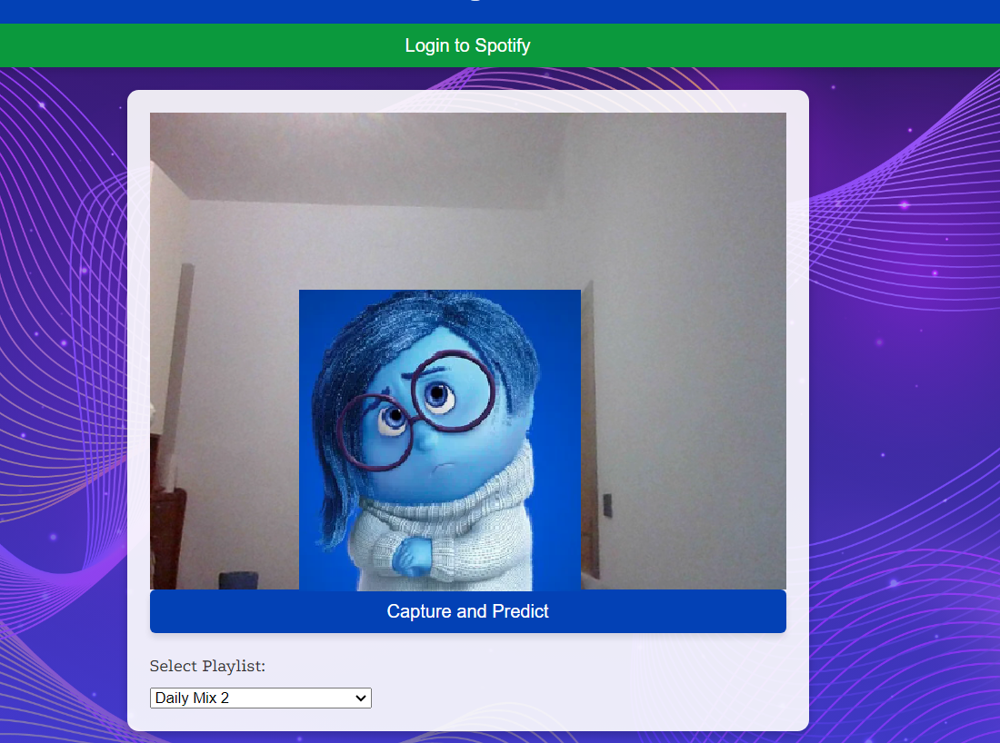
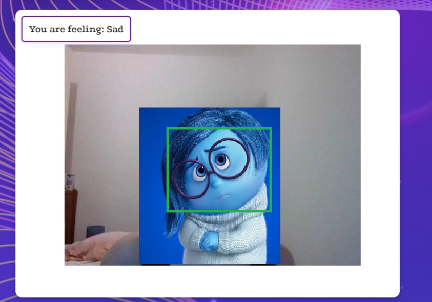

# Emotion based music recommendation 

Model for emotion recognition from kaggle: (https://www.kaggle.com/code/abduulrahmankhalid/emotion-based-music-recommender-resnet50v2/notebook).

Pre-trained model ResNet50V2 trained on the ImageNet dataset: https://github.com/keras-team/keras/blob/v3.3.3/keras/src/applications/resnet_v2.py#L6

Model for mood recognition based on: (https://github.com/michaelmoschitto/AISongRecommender)

This is a web interface implemented on [Python](https://www.python.org) that uses a model to recognize emotion and recommend songs from Spotify.

## Install

* Go to the root of cloned repository
* Install dependencies by running `pip3 install -r requirements.txt`

## Run

Execute:

```
python3 app.py
```

It will start a webserver on http://127.0.0.1:5000. Use any web browser to open the web interface.

Using the interface you can capture the screenshot from your webcam and see predicted emotion. You can choose your playlist from the dropdown menu. Two lists are displayed to either improve your emotional state or match your emotional state. Each list displays up to 5 songs. 

<div align="center">

</div>
<div align="center">

</div>
<div align="center">

</div>